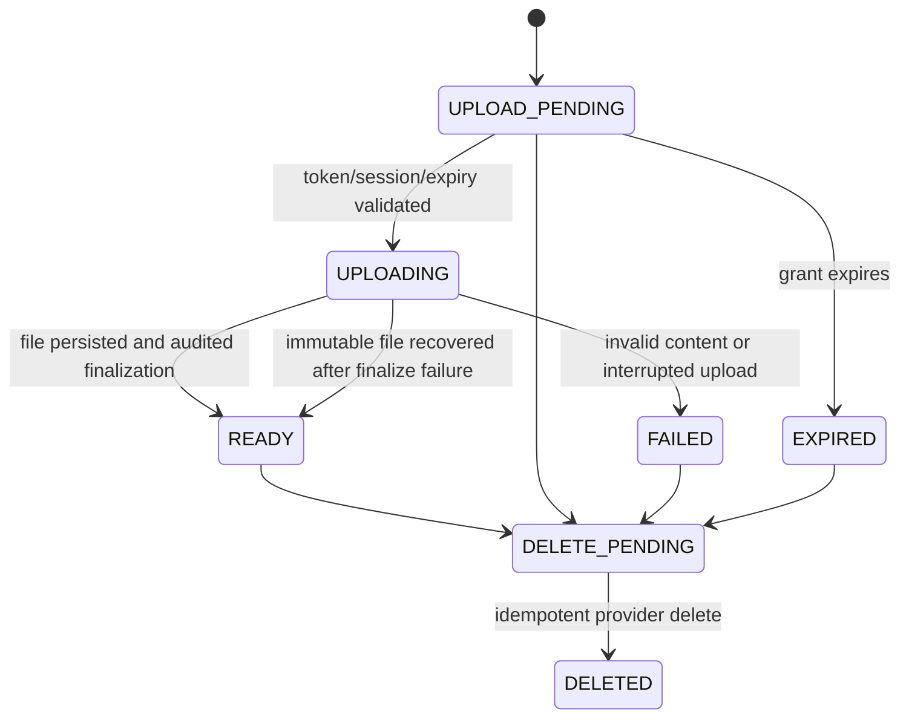
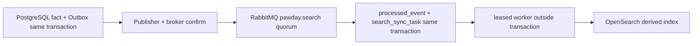

# M2.3 资源与搜索模型

## 对象存储及媒体边界

`ObjectStorageProvider` 提供 providerId、受控 Key 的 put/read/delete/metadata 及可选暂存清理；开发适配器写真实文件，业务服务依赖接口。生产 profile 默认拒绝本地适配器，需要显式配置正式 provider bean。服务端签发上传授权，不暴露任选 bucket/key 的能力。

`media_asset` 保存 owner_id、realm、owner_session_id、scope、可选 store_id、provider、object_key、mime、size、SHA-256、状态和恢复元数据，不保存 bytea/oid 大文件。当前允许 PNG/JPEG、最大 5MiB，凭证默认 300 秒并绑定登录会话；有效凭证在第一次上传尝试时消耗。PRODUCT 需要商家身份及当前分配门店，其他用途不允许门店 ID；资源读写要求本人主体和身份域，PRODUCT 再检查门店。M3 的公开商品图片、文章发布权限及文件关联关系仍由相应业务领域定义。

上传先在短事务中 claim，再在事务外限量读流、校验 MIME/魔数、实际长度、SHA-256、图片解码和尺寸，写不可覆盖 Key，最后 fenced 更新 READY + audit。文件已写而最终数据库事务失败时保留 UPLOADING，恢复检查同一对象内容后完成。旧 worker 失去租约不能删除已被恢复为 READY 的文件。DELETE_PENDING 与失败/过期文件清理持久重试；崩溃留下的暂存文件在超过 24 小时后按有限批次清理。文件夹必须由服务器账号控制，拒绝任意路径、符号链接及不正常父目录。

## 权威商品源与事件接线

`catalog_search_source` 是 M3 接入前的 PostgreSQL 商品检索事实接口，包含 SKU、SPU、单调 revision、完整字段文档与 deleted；没有提前开放商品 CRUD API。`CatalogSearchSource.change` 可加入调用方业务事务，事实变化与以下事件同提交：`CatalogPublished`、`OfferChanged`、`InventoryAvailabilityChanged`。事件只携带 sku_id/revision，consumer 始终读取 PostgreSQL 当前事实。

Search consumer `(search-product-v1,event_id)` 去重，提交 Inbox 和任务后 ack。解析失败走 DLQ；处理失败沿用 M2.2 的有界重试/Outbox DLQ。外部 OpenSearch 更新失败只改变同步任务，不撤销商品事实。

`search_sync_task` 按 `(source_id,target_index)` 合并最新责任，SKIP LOCKED 抢占、claim token/lease fencing；工作开始时读取最新 revision。外部版本写入保持旧 worker 无法覆盖新版；墓碑文档保留删除版本。默认最大 5 次指数重试，DEAD 保留原因并生成 DLQ 转发责任；管理员可通过 search.retry 或原 Outbox replay 恢复。消费者 PROCESSED 记录不会被删除或清空。

## 索引、重建与恢复

首个物理索引为 `pawday-product-v1-000001`，读取别名 `pawday-product-read` 过滤 deleted=false，写入别名 `pawday-product-write` 指定单个目标。V1 strict mapping 包括 spu_id/sku_id/brand/pet_category/life_stage/food_type/allergens/price_min_fen/in_stock/merchant_count/published_at/revision/deleted；不包含推荐算法。

`SearchReindexRequested` 与审计同提交，通过 Rabbit consumer 创建 `search_rebuild_job`。重建在扫描前注册 BUILDING 索引，后续事件同时派生 ACTIVE/BUILDING 任务；逐项有持久失败记录。新索引全部任务 APPLIED 后刷新并逐个对比完整 PostgreSQL 文档、文档数量和摘要，再原子切读写别名，最后记录 ACTIVE/COMPLETED。发现新提交造成验证不一致会重新播种和延期，旧索引不受影响。切换响应或随后数据库提交丢失时，以实际两个别名目标恢复完成；跨 JVM bootstrap/cutover 用短 session advisory lock 协调，外部 HTTP 期间不打开业务事务。

对账读取实际索引并与事实比对，有缺失、字段漂移或孤儿文档时生成新索引重建责任。它不会根据搜索内容写回 PostgreSQL。旧物理索引保留供审查；版本保留/大规模分批构建与清理策略在后续容量阶段完善。

`/admin/operations/search` 提供最多 100 条版本/重建元数据与任务状态计数；rebuild/reconcile/retry 需要 search.manage、action/session 二次验证、Idempotency-Key 和同事务审计。read 需要 search.read。所有授权通过现有身份边界。

## 基础设施验收与范围

`SearchHealthIndicator` 实际请求集群、别名和 mapping。Redis 健康由 Spring Redis 指标实际连接验证；M2.3 门禁另测 PING/读写/TTL 和真实 TCP 不可达后的 DOWN/UP 恢复。搜索基础初始化无法连接时后端可启动，定时任务重试；事实提交不依赖搜索服务健康。

本地门禁使用真实 Windows PostgreSQL、RabbitMQ、官方 OpenSearch ZIP、redis-windows 社区构建的真实 Redis；联合 health 证明四个组件同时 UP。本机仍无 Docker，CI 使用固定官方 Linux 镜像并强制四服务 readiness + 同一 Maven infrastructure-it 门禁。没有将外部服务替换为 mock，远程 CI 和生产云存储尚未实跑。
