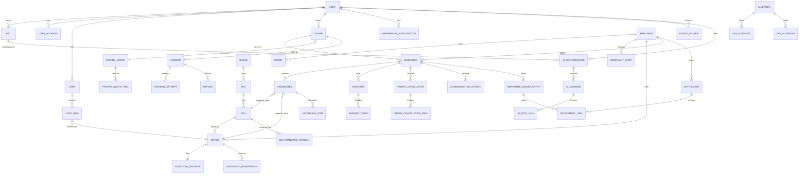

# Pawday V1 领域模型与数据库设计

版本：M1 1.1（整改复验版） · 2026-10-03  
基准：`01-实施计划.md`、`02-三端页面与跳转信息架构.md`、`03-需求覆盖与验收清单.md`，以及 M1 Grill 已确认决策。

> 本文定义领域边界、核心实体、关系表、约束、快照、版本和一致性规则。它是后续状态机、OpenAPI 与工程实现的数据库基准，不代表数据库已实际创建。

---

## 1. 设计目标与总原则

Pawday V1 使用 **模块化单体**，核心交易数据落在 **PostgreSQL**。Redis 仅用于缓存、验证码、限流、会话和短时辅助协调，不能替代关系数据库成为订单、库存、支付、结算的最终事实来源。

核心原则：

1. **金额 V1 暂定使用整数分（fen）保存**，例如 `¥19.99 -> 1999`。所有金额字段统一使用 `BIGINT`，禁止核心账务字段使用浮点数。若未来更换金额表示方式，必须通过统一 Money 类型和迁移方案调整，不能由各模块自行修改。
2. **标准商品、SKU、商家报价分离**：SPU/SKU 是平台标准商品数据；Offer 是商家销售行为。
3. **订单保留快照**：历史订单不得通过当前商品、当前报价、当前优惠规则反向重算过去事实。
4. **库存以 Offer/SKU 为销售维度**，库存预占、释放、扣减均需服务端事务保证。
5. **总订单和商家子订单分离**：履约真实状态在子订单，父订单状态由子订单聚合得出。
6. **支付、退款、结算、积分采用独立账本/单据模型**，不通过直接覆盖余额来隐藏历史。
7. **正式财务记录不可静默 UPDATE**：纠错使用新建调整记录。
8. **关键写操作幂等**：下单、支付确认、退款、积分发放、会员权益发放、优惠券核销等必须有业务唯一键或幂等键。
9. **运营参数不写死客户端**：会员价、AI 额度、佣金、结算周期、优惠门槛、库存锁时间等由后台版本化配置。
10. **AI 不拥有业务事实**：AI 只读取经过权限过滤的结构化数据；商品、库存、价格、订单、宠物档案修改均以业务数据库为准。
11. **审计可追溯**：商家、平台管理员、财务、商品审核、AI 配置、风控动作必须记录操作者、对象、差异和业务关联。
12. **Outbox 保证事件可靠发布**：核心事务先落库，再可靠投递到 RabbitMQ；通知/搜索同步失败不能反向抹掉已成立的财务事实。

---

## 2. 领域边界

V1 领域按下列模块划分。初期可部署在同一后端应用，但代码、数据访问和服务契约必须保持边界。

| 领域 | 主要职责 |
|---|---|
| Identity | 消费者账号、手机号/微信绑定、设备、会话、再验证 |
| Pet | 宠物分类、宠物档案、过敏/忌口、体重、观察、当前粮 |
| Merchant | 商户主体、门店、认领、员工、角色与权限 |
| Catalog | 品牌、SPU、SKU、标准配料/营养/过敏原、版本、导入审核 |
| Offer & Inventory | 商家报价、会员价、库存、预占、销售状态 |
| Search & Recommendation | 搜索索引、自然语言解析结果、推荐输入与结果引用 |
| Cart & Pricing | 购物车、报价试算、运费、优惠组合、会员价、价格快照 |
| Order | 总订单、商家子订单、订单项、履约快照 |
| Payment | 支付单、支付尝试、渠道回调、退款单 |
| Fulfillment | Shipment、物流公司、运单、部分发货 |
| AfterSales | SKU/数量级售后、退货、平台介入、证据 |
| Finance | 佣金策略、结算周期、商家账本、结算单、调整与对账 |
| Promotion | 平台券、商家券、运费券、活动、预算、核销 |
| Membership | 付费会员计划、会员订单、权益有效期 |
| Points | 积分账本、签到、评价奖励、兑换 |
| Review | 真实购买评价、图片/视频、宠物标签授权 |
| Nearby | 地点、门店公开信息、认领状态、认证状态、高德引用 |
| Content | 轻量文章、商品挂载、推广标记 |
| Messaging | 站内消息、推送偏好、商家/平台客服会话 |
| AI | AI 会话、额度账本、Prompt/规则版本、工具调用、档案变更建议 |
| Risk | 风险案件、规则命中、处罚/冻结、异常低价 |
| Audit & Config | 审计日志、运营配置、Outbox、任务与系统版本 |

---

## 3. ER 总览



---

## 4. 身份与账户域

### 4.1 `users`

消费者主账号。

| 字段 | 类型 | 说明 |
|---|---|---|
| `id` | UUID/ULID | 主键 |
| `status` | ENUM | ACTIVE / LOCKED / DELETED_PENDING / ANONYMIZED |
| `phone_e164` | VARCHAR | 主手机号，唯一约束仅对有效账号生效 |
| `display_name` | VARCHAR | 昵称，可空 |
| `created_at` | TIMESTAMPTZ | 创建时间 |
| `updated_at` | TIMESTAMPTZ | 更新时间 |
| `deleted_at` | TIMESTAMPTZ | 注销/匿名化时间 |
| `version` | BIGINT | 乐观锁版本 |

规则：

- V1 主账号以手机号为核心。
- 注销后手机号/微信未来可在满足政策后重新使用，但**新账号不得自动恢复旧订单、宠物、会员、积分**。
- 历史订单中的收货人/联系方式依赖订单快照，不依赖 `users` 当前值。

### 4.2 `user_identities`

存手机号、微信等身份绑定。

| 字段 | 说明 |
|---|---|
| `id` | 主键 |
| `user_id` | 用户 |
| `provider` | PHONE / WECHAT |
| `provider_subject` | 微信 openid/unionid 或标准化手机号 |
| `verified_at` | 验证时间 |
| `status` | ACTIVE / UNBOUND |

唯一约束：`(provider, provider_subject, ACTIVE)` 不得重复。

微信/手机号冲突不得静默覆盖或自动合并，必须进入受控验证流程。

### 4.3 `user_devices` / `auth_sessions`

保存登录设备、风险属性和会话撤销状态。用户可查看设备并使其他设备会话失效。

### 4.4 `user_addresses`

支持多个地址、默认地址、家/公司标签。

订单生成后使用 `order_address_snapshot`，后续修改地址不影响历史订单。

---

## 5. 宠物域

### 5.1 分类结构

`pet_species`：五大父分类（猫、狗、水族/水宠、鸟、小宠）以及动态子类。  
`pet_breeds`：按物种维护品种，可停用但历史引用不能删除。

“小宠”必须为可扩展父分类，不能把仓鼠/兔/豚鼠等写死进代码枚举。

### 5.1.1 物种生命周期taxonomy（正式）

`pet_life_stage_rule_versions`：id、species_id、version_no、status（DRAFT/PUBLISHED/RETIRED）、source_refs、published_at。发布版本不可覆盖；每物种最多一个当前版本。

`pet_life_stage_definitions`：id、rule_version_id、stage_code、display_name、min_age_value、max_age_value（NULL=无上限）、age_unit（DAY/MONTH/YEAR）、priority、is_unknown、source_refs。按物种定义阶段，`UNIQUE(rule_version_id, stage_code)`；年龄范围采用[min,max)，非UNKNOWN上下限有合法CHECK。V1同一物种版本非UNKNOWN范围不重叠；priority仅解决明确的物种级/父类继承顺序，不掩盖重复范围。

五父分类均有UNKNOWN定义；实际阶段规则绑定具体物种，猫/狗也通过配置，水族/鸟/小宠不能套用猫狗年龄阈值。阶段code为可扩展字符串，不是全物种统一客户端枚举。标准商品通过 `sku_life_stage_targets(standard_version_id, stage_definition_id)` 引用具体版本。age单位与数据来源一致，不把月/年强行按30/365天转换；生日按历法计算完整年龄单位，估算不足以确定边界时返回UNKNOWN。

匹配优先使用具体物种已发布规则，仅允许该规则显式声明的父类继承；无生日/年龄、无可信规则、未覆盖年龄或证据不足均返回UNKNOWN/信息不足，不能判定适合。数值阈值须由平台有来源的商品与物种知识审核后配置，M1不虚构五类统一生长年龄。

### 5.2 `pets`

| 字段 | 说明 |
|---|---|
| `id` | 主键 |
| `owner_user_id` | 唯一所有者 |
| `name` | 名称 |
| `species_id` | 宠物类型 |
| `breed_id` | 品种，可空 |
| `birth_date` | 生日，可空 |
| `age_estimate_months` | 年龄估算，可空 |
| `sex` | MALE / FEMALE / UNKNOWN |
| `neutered_status` | YES / NO / UNKNOWN |
| `activity_level` | LOW / MEDIUM / HIGH / UNKNOWN |
| `current_weight_g` | 当前体重克数，可空 |
| `status` | ACTIVE / DELETED |
| `version` | 乐观锁 |

V1 一只宠物只归一个用户，不支持多人共享。

### 5.3 过敏/忌口

`allergens`：平台标准化过敏原词典。  
`pet_allergens`：宠物与标准过敏原关联。

必须区分：

- `UNKNOWN`：未确认/不知道
- `NO`：明确无
- `YES`：明确有

可追加：严重程度、信息来源（主人观察 / 兽医已诊断）、备注。

AI 不得把 `UNKNOWN` 当成 `NO`。

### 5.4 `pet_weight_records`

时间序列体重记录，保存克数、记录日期、来源。

### 5.5 `pet_observations`

记录食欲、便便、皮肤、每日喂食量等用户自填观察，必须与“兽医已诊断信息”分区存放。

### 5.6 当前粮

`pet_current_foods`：当前粮引用 SKU 或手工名称、包装重量、开始日期、每日食用量、用户校准量。

剩余天数属于**派生值**，不作为不可变事实；计算时标记“预计”。

---

## 6. 商户、门店与权限域

### 6.1 `merchants`

商户主体。Pawday 自营作为特殊商户记录，字段 `merchant_type = PLATFORM_SELF_OPERATED`，不得另建一套交易模型。

### 6.2 `stores`

一个商户可管理多个线下门店。

认领、认证、官方身份分别建模：

- `claim_status`：UNCLAIMED / UNDER_REVIEW / CLAIMED
- `pawday_certification_status`：NONE / VERIFIED
- 官方旗舰店不放在门店字段中，而是通过品牌授权关系判断

### 6.3 `merchant_brand_authorizations`

保存商家与品牌之间的官方/授权关系、证据、有效期和审核状态。前台“官方旗舰店”只能由此类审核结果派生，不能由商家自填。

### 6.4 `merchant_staff`、`merchant_roles`、`merchant_staff_roles`

员工支持多个角色。

权限合并规则：

- 功能权限取角色并集；
- 数据范围仍受 merchant/store scope 约束；
- 财务、退款、高风险设置等敏感权限可以附加二次验证和单独授权。

---

## 7. 标准商品域

### 7.1 `brands`

平台标准品牌，保存来源、状态和品牌级元数据。

### 7.2 `spus`

标准商品实体，例如“皇家室内成猫粮”。

主要字段：品牌、商品名、适用品种/阶段、类目、商品状态。

### 7.3 `skus`

标准规格，例如 400g / 2kg / 4kg / 10kg。

主要字段：

- `spu_id`
- `sku_code`
- `barcode`
- `weight_g`
- `package_unit`
- `status`

### 7.4 标准资料版本

`sku_standard_versions` 保存不可覆盖的版本：

- 配料结构化数据
- 营养成分
- 过敏原
- 适用阶段
- 原始来源
- 来源更新时间
- `published_at`
- `version_no`

新请求读取最新 `PUBLISHED` 版本；历史订单、历史 AI 输出保留当时版本 ID。

### 7.5 `sku_allergens`

SKU 与标准化过敏原词典关联。

### 7.6 商品审核与批量导入

- `catalog_change_requests`：商家新品/纠错申请
- `catalog_review_records`：平台审核记录
- `catalog_import_batches`：Excel/CSV 导入批次
- `catalog_import_rows`：逐行校验、重复、失败原因

未经校验不得直接覆盖标准商品数据。

---

## 8. 商家报价与库存域

### 8.1 `offers`

商家对一个 SKU 的销售报价。

| 字段 | 说明 |
|---|---|
| `id` | Offer 主键 |
| `merchant_id` | 商户 |
| `store_id` | 可选履约门店/仓 |
| `sku_id` | 标准 SKU |
| `sale_price_fen` | 普通售价 |
| `member_price_fen` | 会员价，可空 |
| `sale_status` | DRAFT / ACTIVE / PAUSED / FROZEN / DELISTED |
| `fulfillment_sla` | 发货承诺 |
| `version` | 乐观锁 |

正式 invariant：同一商户、同一履约范围、同一 SKU 只能有一个非下架 Offer，适用于 DRAFT / ACTIVE / PAUSED / FROZEN；DELISTED 保留历史并允许重新建报价。

履约范围 V1 使用 `store_id`（NULL 表示商户默认履约范围），门店必须属于该商户。PostgreSQL 15+ 的正式约束语义：

```sql
CREATE UNIQUE INDEX uq_offer_live_scope
ON offers (merchant_id, sku_id, store_id) NULLS NOT DISTINCT
WHERE sale_status IN ('DRAFT', 'ACTIVE', 'PAUSED', 'FROZEN');
```

NULL 必须参与唯一性，不能让商户默认范围因 NULL 绕过约束。M2 迁移落实该索引及门店归属复合外键。

### 8.2 `inventory_balances`

Offer 维度库存事实。

关键字段：

- `on_hand_qty`
- `reserved_qty`
- `available_qty` 可由前两者派生或冗余维护，但必须受数据库约束
- `version`

约束：

- `on_hand_qty >= 0`
- `reserved_qty >= 0`
- `reserved_qty <= on_hand_qty`

### 8.2.1 `inventory_adjustments`（唯一商家库存写入命令）

字段：id、merchant_id、operation（INVENTORY_ADJUSTMENT）、offer_id、delta_qty（有符号整数，非0）、reason_code（RESTOCK/COUNT_CORRECTION/DAMAGE）、expected_version、before_on_hand_qty、resulting_on_hand_qty、resulting_reserved_qty、resulting_version、actor_id（服务端会话产生）、idempotency_key、payload_hash、created_at。

`UNIQUE(merchant_id, operation, idempotency_key)`；流水不可覆盖。短事务锁inventory_balance，先验证version，再执行on_hand += delta_qty；结果必须on_hand>=reserved>=0。负调整不能侵占已预占数量，冲突返回409 `INVENTORY_ADJUSTMENT_CONFLICT`。商家不可提交target_on_hand_qty、reserved_qty或operator。初始库存也从0用Adjustment建立，批量调整逐项同样命令并返回结果，不允许PATCH旁路。

支付扣减、预占释放、取消恢复由内部业务库存流水驱动，不伪装为商家Adjustment；都携带唯一来源事件键。

### 8.3 `inventory_reservations`

支付前库存预占记录。

字段：

- `reservation_key`
- `offer_id`
- `order_item_id`
- `qty`
- `status`：ACTIVE / CONSUMED / RELEASED / EXPIRED
- `expires_at`

默认锁 15 分钟，但值由后台配置。

同一个下单幂等键重复请求不能重复预占。

---

## 9. 购物车、定价与优惠域

### 9.1 `carts` / `cart_items`

购物车项保存明确 Offer，不允许后端在失效时静默替换商家。

登录合并游客购物意图时，需要重新校验 Offer、价格和库存。

### 9.2 Pricing Quote（正式实体）

`pricing_quotes`、`pricing_quote_items`、`pricing_quote_merchant_groups`、`pricing_quote_discount_allocations` 必须持久化在 PostgreSQL。Redis 只缓存读取，不持有唯一事实。Quote 是用户确认前的服务端定价事实，**不预占库存、不锁券、不保证库存**。

`pricing_quotes`：

| 字段 | 类型/约束 |
|---|---|
| id / user_id | 主键 / 用户归属外键 |
| address_id / address_version / address_snapshot | 地址引用、版本和不可变地址快照；新订单校验一致 |
| membership_snapshot | 是否享会员价、会员有效期、计划版本 |
| currency | 固定 CNY |
| goods_amount_fen / shipping_amount_fen / discount_amount_fen / payable_amount_fen | BIGINT 非负；goods + shipping - discount = payable |
| pricing_rule_version / algorithm_version | 必填不可变规则版本 `PRICING_V1_1` / `LARGEST_REMAINDER_V1` |
| input_hash / snapshot_hash | 原始选项与冻结金额/条件快照的哈希 |
| status | ACTIVE / CONSUMED / EXPIRED / INVALIDATED |
| expires_at / created_at | 必填 TIMESTAMPTZ；有效期限来自配置版本 |
| consumed_order_id / consumed_at | 成功消费后的订单关系；同一个Quote最多一个订单 |
| version | BIGINT 乐观锁 |

`pricing_quote_items`：id、quote_id、稳定 `allocation_key`、cart_item_id/cart_item_version、offer_id/offer_version、sku_id/catalog_standard_version_id、merchant_id、quantity、unit_price_fen、goods_amount_fen、discount_amount_fen、payable_amount_fen。`UNIQUE(quote_id, allocation_key)`；quantity > 0；goods = quantity × unit_price；payable = goods - discount ≥ 0。

`allocation_key` 为 Quote 创建时按 `(merchant_id, offer_id, cart_item_id)` 规范字符串排序分配的连续序号。下单复制该键，不使用尚不存在的 order_item_id 决定报价尾差。

运费只在 `pricing_quote_merchant_groups` 存一次：merchant_id、shipping_amount_fen、shipping_discount_fen、shipping_payable_fen、运费规则/配送范围版本；`UNIQUE(quote_id, merchant_id)`。订单项不重复累加整商家运费。

`pricing_quote_discount_allocations`：quote_id、coupon_instance_id/活动版本、scope（GOODS / SHIPPING）、allocation_key或merchant_id、sequence_no、eligible_base_fen、discount_fen、rule_version、algorithm_version。优惠来源及返券规则快照不可覆盖。

消费规则：服务端先检查幂等重放，再锁Quote验证归属、ACTIVE、有效期、地址/购物车/Offer版本、会员与优惠资格，按相同规则重放金额与快照。任何依据变动返回 409 `PRICE_CHANGED` / `OFFER_CHANGED` / `CONCURRENT_MODIFICATION`；过期返回 `PRICE_QUOTE_EXPIRED`，不可静默接受新金额。用户重新获取并确认新Quote。

同一下单事务中完成库存预占、锁券、创建订单与Payment、写Outbox，并将Quote置CONSUMED。`orders.quote_id NOT NULL UNIQUE` 与Quote消费引用保证一对一；事务失败不消费Quote。不同幂等键消费同一Quote返回409 `QUOTE_ALREADY_CONSUMED`；原键重试返回原订单。有效期任务将未消费过期Quote置EXPIRED；明确事实失效置INVALIDATED，历史快照保留。

### 9.3 优惠券

`coupon_definitions`：优惠券定义。  
`user_coupons`：用户持券实例。  
`coupon_redemptions`：核销记录。

V1 类型：新人券、平台券、商家券、运费券；数据模型预留品牌/品类/会员券。

定义状态 `DRAFT / PUBLISHED / STOPPED / EXPIRED` 与持券实例状态 `AVAILABLE / RESERVED / USED / RETURNED / EXPIRED / VOID` 分开。`user_coupons` 必须存 status、reserved_order_id、reserved_from_status、reservation_expires_at、definition_version、version；核销/返还记录带唯一业务键。RETURNED 是可再次使用的持券状态，不另发一张券以防复制；必须未过期且未VOID。所有转换见05第9节。

### 9.3.1 规则版本与退款单位

`pricing_rule_versions`：id、version_code唯一、algorithm_version、parameters_json、content_hash、status、published_at、created_by；发布后不可覆盖，初始`PRICING_V1_1`按05第8节配置。

`order_item_refund_units`：order_item_id、unit_index（1..quantity）、paid_amount_fen；`UNIQUE(order_item_id, unit_index)`，保存冻结商品实付的每个逻辑单位退款额度，不随现价变化。

`order_refund_unit_claims`：id、order_item_id、unit_index、source_type（CANCELLATION/AFTERSALE）、source_item_id、refund_id可空、status（RESERVED/REFUNDED/RELEASED）。RESERVED/REFUNDED同一单位最多一个claim（部分唯一索引）；源明细引用唯一。申请持order_item行锁占未使用单位；失败终止/拒绝按政策释放，已成立取消退款失败不得释放。金额0的单位只完成业务数量流程，不创建0元渠道退款单。

### 9.4 优惠分摊

订单落库时建立 `order_discount_allocations`：

- 以符合优惠条件的订单项实价作为基数按比例分摊
- 整数分尾差正式采用 `LARGEST_REMAINDER_V1`，按余数降序、allocation_key升序补齐；应用顺序、叠加、最低实付使用05第8节 `PRICING_V1_1`
- 保存分摊来源、规则版本和最终结果
- 后续退款使用已冻结分摊结果，不重新按当前门槛计算

部分退款通常不返券；相关优惠范围全部取消时，可按下单时规则快照决定是否返还仍有效券。

---

## 10. 订单域

### 10.1 `orders`

消费者总订单，表示一次统一结账和支付意图。

核心字段：

- `order_no`
- `user_id`
- `currency = CNY`
- `goods_amount_fen`
- `shipping_amount_fen`
- `discount_amount_fen`
- `payable_amount_fen`
- `payment_status_summary`
- `fulfillment_status_summary`：派生/聚合字段
- `pricing_snapshot_version`
- `idempotency_key`

总订单状态不得由运营人员直接任意修改，履约展示状态根据子订单聚合。

### 10.2 `suborders`

每个商家一个商家子订单。

核心字段：

- `order_id`
- `merchant_id`
- `suborder_no`
- `fulfillment_status`
- `goods_amount_fen`
- `shipping_amount_fen`
- `discount_amount_fen`
- `paid_amount_fen`
- `after_sales_buffer_days_snapshot`
- `commission_policy_id_snapshot`

### 10.3 `order_items`

保存 SKU/Offer 快照，不依赖当前商品表回填历史。

快照至少保存：

- SKU 名称、规格、重量
- 品牌
- 标准商品版本 ID
- Offer ID / merchant ID
- 商品单价
- 会员价是否使用
- 数量
- 商品原金额
- 分摊优惠
- 商品实付
- 商家服务/售后规则版本
- 可选绑定宠物 ID（购买关联）

### 10.3.1 部分取消的权威模型

正式采用取消主单/明细及不可覆盖事件：

- `order_cancellations`：id、suborder_id、actor_type/actor_id、reason_code、status、idempotency_key、payload_hash、created_at、version。状态 `REQUESTED / ACCEPTED / REFUND_PENDING / COMPLETED / REJECTED`；主单状态可受控迁移，历史事件不覆盖。
- `order_cancellation_items`：id、cancellation_id、order_item_id、quantity、item_payable_refund_fen、shipping_refund_fen、allocation_snapshot、refund_id（未付款可NULL）；`UNIQUE(cancellation_id, order_item_id)`，quantity>0，金额≥0。ACCEPTED之后明细不可编辑/删除。
- `order_cancellation_events`：append-only，cancellation_id、前后状态、actor、reason、source_event_id、occurred_at；事件业务键唯一。
- `order_items.cancelled_qty` 为可重建汇总缓存，不是独立事实；来源是状态为ACCEPTED / REFUND_PENDING / COMPLETED的取消明细。REQUESTED/REJECTED不占取消数量。

取消与发货使用同一order_item行锁/统一锁顺序：确认可取消量 = purchased_qty - cancelled_qty - 已实际发货qty - 处理中售后锁定的未发货qty；在同一事务校验、接受取消、更新缓存、写事件，并创建退款/释放库存命令。重放幂等键不得重复占数量。

**接受取消即停止对应数量发货**，不等待退款成功。已付款取消恢复已扣销售库存一次（库存流水业务键 `cancellation_item_id`）；退款失败保留取消量和库存恢复，不撤销取消、不重新发货，只重试同一Refund。未付款取消释放对应预占而非增加on_hand；整总单未付款取消关闭Payment。

V1未付款不允许部分减少应付金额：未付款取消须覆盖父订单全部有效数量，否则422 `UNPAID_PARTIAL_CANCELLATION_NOT_ALLOWED`；用户重建Quote。已付款才允许未发货项的部分取消。售后退货退款数量不计入cancelled_qty，单独统计，以免把已发货历史抹掉。

跨项累计约束由服务层持锁事务/受控数据库过程保证，不能伪装为普通跨表CHECK。`0 <= cancelled_qty <= quantity` 是本行CHECK；缓存漂移通过重建任务发现，禁止仅依赖日志文本推导。

### 10.4 `order_address_snapshots`

保存订单提交时完整收货地址快照。

### 10.5 下单原子性

同一次跨店提交中，如果任一选中 Offer 库存预占失败：

- 整次提交失败
- 不自动删除缺货项
- 不自动换商家
- 已产生的临时预占必须回滚/释放
- 用户重新确认购物车

---

## 11. 发货与履约域

### 11.0 物流事实与适配

`logistics_carriers`维护carrier_code、显示名、状态；`shipment_tracking_events`保存shipment_id、provider_reference、event_id或内容hash、原始状态、归一化状态、occurred_at、description、location；`UNIQUE(shipment_id, provider_reference, event_key)`。`shipment_tracking_syncs`记录last_synced_at、stale、查询失败和重试状态。

LogisticsProvider契约见06第52.3节；轨迹签收不等同消费者确认收货。

### 11.1 `shipments`

一个子订单允许多个包裹。

字段：

- `suborder_id`
- `shipment_no`
- `carrier_code`
- `tracking_no`
- `status`
- `shipped_at`
- `delivered_at`

### 11.2 `shipment_items`

支持按订单项和数量拆包。

约束：同一 `order_item_id` 所有 shipment item 数量之和不得超过订单购买数量减去已取消数量。

### 11.3 商家缺货

付款后商家发现无法履约时，不自动替换其他商家。受影响的子订单或订单项走取消/退款，其他商家继续履约，并产生商家履约风险事件。

---

## 12. 支付与退款域

### 12.1 `payments`

Payment是应付支付意图，**不拥有创建时channel字段**。

字段：id、payment_no、order_id（商品订单）或membership_order_id（二者恰好一个非NULL）、amount_fen、currency、status、expires_at、idempotency_key、successful_attempt_id（成功前NULL）、version。商品订单有效支付意图唯一；关联成功Attempt须同属此Payment，事务中受控设置一次。

`final_channel` 是 successful_attempt_id → payment_attempts.channel 的只读派生值，成功前NULL。重复/晚到的第二次真实收款保存异常款项记录并原路退款，不覆盖successful_attempt_id，不再次确认订单。

### 12.2 `payment_attempts`

字段：id、payment_id、attempt_no、channel（WECHAT / ALIPAY / MOCK）、environment（MOCK / SANDBOX / PRODUCTION）、client_platform、provider_merchant_ref、provider_request_no、provider_transaction_id、status、amount_fen、created_at、closed_at、verified_at、version。

每次Attempt必须使用新的渠道请求号；`UNIQUE(channel, provider_merchant_ref, provider_request_no)`，成功流水号同范围唯一。生产拒绝MOCK渠道。状态为CREATED / CHANNEL_REQUESTED / CHANNEL_PENDING的活动Attempt在一个Payment下最多一个（部分唯一索引）。

安全切换须锁Payment，查询/关闭旧渠道并获得可证明不可再扣款的结果，再新建Attempt；结果未知返回409 `PAYMENT_CONFIRMATION_PENDING`，不能直接把旧Attempt标CANCELLED绕过检查。外部调用不在长DB事务中等待：先建立持久化关闭意图，收到结果后短事务验证version与旧Attempt终态，才能创建新Attempt。

客户端返回不构成成功事实。Webhook按原始渠道单号定位Attempt并核验商户、金额、币种和环境，再关联Payment。Refund必须保存 `payment_attempt_id`，按实际收款Attempt原路退款；晚到/重复收款补偿也绑定异常Attempt，不按Payment派生渠道误退。

### 12.3 晚到支付

订单/支付单已关闭后收到真实成功回调：

- 必须记录为可追踪异常
- 默认进入晚到支付补偿流程
- 优先原路退款
- 只有满足明确恢复履约条件时才允许恢复订单
- 不能忽略款项或产生重复入账

### 12.4 `refunds`

退款与售后审批状态分离。

字段：

- `refund_no`
- `payment_id`
- `payment_attempt_id`：原路退款对应的已确认收款Attempt
- `cancellation_id` 可空
- `aftersale_id` 可空
- `amount_fen`
- `channel_refund_no`
- `status`：CREATED / PROCESSING / SUCCEEDED / FAILED_RETRYABLE / FAILED_FINAL / CANCELLED
- `attempt_count`
- `next_retry_at`

退款接口失败后自动幂等重试；超过阈值进入人工异常队列。

退款原路返回实际收款Attempt的微信/支付宝，不建Pawday钱包。渠道退款金额必须>0；0实付单位只做业务完成和数量记录，不发起0元Refund。

---

## 13. 售后域

### 13.1 `aftersales`

售后申请主单，绑定一个商家子订单。

### 13.2 `aftersale_items`

精确到订单项和数量。

必须保证：

- 累计申请售后数量 <= 可售后数量
- 累计退款金额 <= 对应订单项剩余可退实付

### 13.3 优惠与运费退款

- 商品退款基于订单项已冻结的实付/优惠分摊结果，不重新按当前优惠门槛重算。
- 未发货整子单取消，退对应实际支付运费。
- 发货后运费退款依据责任方和平台政策快照决定。

### 13.4 平台介入

`aftersale_evidence` 保存证据；`aftersale_decisions` 保存平台裁决、操作者、金额变化和理由。

---

## 14. 佣金、账本与结算域

### 14.1 `commission_policies`

佣金按品类、商户、活动配置，带优先级、生效时间和版本。

### 14.2 `commission_allocations`

下单时或满足可确认时保存订单/订单项对应佣金快照。

### 14.3 `merchant_ledger_entries`

商家不可静默覆盖账本。

典型类型：

- SALE_CREDIT
- COMMISSION_DEBIT
- REFUND_DEBIT
- COMMISSION_REVERSAL
- SHIPPING_ADJUSTMENT
- SETTLEMENT_DEBIT
- SETTLEMENT_ADJUSTMENT
- MANUAL_ADJUSTMENT

字段必须包括：金额、方向、业务对象、来源事件、调整原因、创建人/系统。

### 14.4 `settlements`

商家结算批次。

默认售后缓冲 7 天，但由后台配置，并可按政策覆盖。

状态和明细在 05 状态机文档中定义。

### 14.5 已结算后退款

禁止修改旧结算单。

发生退款时：

- 新建负向账本/结算调整
- 从后续可结算金额抵扣
- 不足时允许形成商家应收余额

---

## 15. 会员域

### 15.1 `membership_plans`

仅两种用户身份：普通 / 付费会员。

付费计划支持月、年；价格、权益、AI 额度由后台版本化配置。

### 15.2 `membership_orders`

会员购买与商品订单分类型保存。

### 15.3 `membership_subscriptions`

字段：

- `user_id`
- `plan_version_id`
- `starts_at`
- `expires_at`
- `status`

续费规则：如果当前会员仍有效，新购买从当前 `expires_at` 顺延。

V1 不做自动续费。

### 15.4 会员退款

会员退款依据：剩余有效期 + 未使用权益 + 已使用权益规则。

历史商品订单使用过会员价后，不因会员退款追溯改价。

---

## 16. 积分与签到域

### 16.1 `points_ledger`

积分必须走账本，不以单一余额字段作为唯一事实。

类型：

- PURCHASE_EARN
- REVIEW_EARN
- MEDIA_REVIEW_BONUS
- CHECKIN_EARN
- REDEMPTION_SPEND
- REFUND_CLAWBACK
- MANUAL_ADJUSTMENT

允许余额为负：退款追回积分时，如果用户已消费积分，则负余额保留，后续积分先抵扣。**余额<0正式禁止新兑换；余额>=0仍须满足余额>=兑换成本**。兑换在账户行锁下原子检查/扣减，失败返回422 `POINTS_INSUFFICIENT`。

### 16.2 幂等

评价奖励、媒体升级奖励、购买奖励必须有唯一业务键，重复请求不得重复发积分。

### 16.3 签到

连续签到奖励周期最多 30 天。规则由后台配置；不建小游戏模块。

---

## 17. 评价域

`reviews` 必须引用真实已完成交易订单项。

字段包括：评分、文字、购买验证标识、是否授权展示宠物基础标签。

媒体资源存对象存储，数据库只保存引用。

不能因为订单存在就暴露完整宠物档案。

---

## 18. 附近与地点域

### 18.1 `places`

统一保存宠物店、宠物医院、美容洗护、寄养等地点。

字段：名称、分类、坐标、地址、电话、营业信息、公开来源、来源 ID。

### 18.2 `store_claims`

门店认领申请，与认证独立。

### 18.3 医疗边界

宠物医院记录只用于地点、营业信息、联系方式和高德导航，不保存 Pawday 医疗诊断/治疗推荐字段。

---

## 19. 消息与客服域

### 19.1 `notification_preferences`

至少分：订单、售后、降价、到货、吃粮、活动、客服。

业务订阅偏好与系统 Push 权限分开。

### 19.2 `conversations` / `conversation_participants` / `messages`

支持消费者—商家客服、消费者—平台客服。

消息可包含文字、图片、商品卡片、订单卡片。

订单卡片访问必须实时做授权校验。

---

## 20. AI 域

### 20.1 `ai_conversations`

保存：用户、上下文宠物、模型策略版本、创建/过期/清除状态。

用户切换当前宠物后，旧会话仍保留原宠物上下文；新请求默认使用新的当前宠物并显式记录上下文变更。

### 20.2 `ai_messages`

历史 AI 输出保存：

- 对话消息
- 商品/规则数据版本引用
- Prompt/规则版本
- 是否信息不足

历史回答不因标准商品新版发布而自动重写。

### 20.3 `ai_tool_calls`

记录受控工具调用：搜索、收藏、加购物车等。

必须记录真实后端执行结果。工具失败时 AI 不得描述为成功。

AI 禁止直接执行付款。

### 20.4 `ai_quota_ledger`

普通用户和会员额度由后台配置。

正式状态：RESERVED / CONSUMED / RELEASED。`ai_quota_reservations` 按 `(user_id, ai_request_id)` 唯一，保存quota_policy_version、quota_bucket_id、units、status、lease_expires_at、assistant_message_id、version；`ai_quota_ledger` 保存唯一预占/消费/释放事件。

请求前原子预占，剩余可用=额度上限-已消费-有效预占。只有“业务校验通过 + 有效Assistant Message持久化成功”才在同事务转CONSUMED并扣额度；模型返回但DB保存失败不能永久扣额度。网络失败/业务拒绝/超时转RELEASED，释放后晚响应不得消费，重试需新业务请求。预占超时清理与完成持同一行锁，重复重试不重复扣；CONSUMED不可普通改回RELEASED，纠错另写补偿事件。

### 20.5 `ai_profile_proposals`

AI 根据对话建议修改宠物档案时保存字段级 diff、宠物版本号和状态：PENDING / ACCEPTED / REJECTED / EXPIRED。

用户确认时再次校验宠物版本，发生冲突必须重新展示。

### 20.6 Prompt / 规则版本

- `ai_prompt_versions`
- `ai_rule_versions`
- `ai_release_rollouts`

版本不可覆盖，支持灰度、回滚和审计。

---

## 21. 风控域

### 21.1 `risk_cases`

覆盖：

- 优惠券套利
- 刷单
- 刷评价
- 异常退款
- 商家自买自卖
- 异常低价
- 账号异常登录

### 21.2 `risk_hits`

保存规则命中证据，不把风险评分本身等同于违规结论。

异常低价 Offer 可以被降权、暂停或冻结，所有动作需审计。

---

## 22. 审计、配置与可靠事件

### 22.1 `audit_logs`

字段至少包括：

- actor type / actor id
- role snapshot
- action
- object type / object id
- before diff / after diff
- request source
- IP/device reference（敏感值按策略脱敏）
- related business id
- created_at

密码、支付密钥、令牌、完整敏感证件不得原样写日志。

### 22.2 `operation_configs`

版本化运营配置，例如：

- 会员月/年价格
- 普通/会员 AI 额度
- 佣金率
- 结算周期
- 售后缓冲期（默认 7 天）
- 库存锁时间（默认 15 分钟）
- 优惠券门槛
- 包邮门槛
- 签到规则
- 首发城市

配置需有作用域、版本、生效时间、创建人和审计。

### 22.3 `outbox_events`

核心事务与业务数据同事务写入 Outbox。

字段：

- event_id
- aggregate_type
- aggregate_id
- event_type
- payload_json
- occurred_at
- published_at
- retry_count
- status

RabbitMQ 发布成功后更新发布状态。

### 22.4 `consumer_event_inbox`

对需要强幂等的消费者建议保存已消费事件 ID，避免 MQ 重投造成重复积分、重复通知或重复索引操作。

---

## 23. 搜索索引与同步

PostgreSQL 是事实源，搜索服务是派生索引。

商品/Offer/品牌/标准资料发生变化：

1. 业务事务提交；
2. 写 Outbox；
3. 事件发布 RabbitMQ；
4. 搜索消费者增量更新索引；
5. 失败按指数退避重试；
6. 超过阈值进入死信/异常队列；
7. 提供全量重建和数据库—索引一致性校验任务。

搜索索引失效不能导致核心交易数据丢失。

---

## 24. 关键唯一约束与检查约束

正式约束至少包含（跨行累计约束由受控锁行事务实现，不用普通CHECK冒充）：

- `user_identities(provider, provider_subject)` 有效状态唯一
- `merchant_brand_authorizations` 同商家/品牌/授权类型有效期冲突检查
- `skus.barcode` 在同标准范围内唯一
- 有效 Offer 在商户+SKU+履约范围内唯一
- 库存 `reserved_qty <= on_hand_qty`
- 下单 `orders.idempotency_key` 唯一
- 支付渠道成功流水号唯一
- 退款渠道退款号唯一
- 积分奖励业务键唯一
- 评价真实购买订单项 + 用户的资格唯一策略
- 优惠券核销幂等键唯一
- Shipment item 累计数量不超过可发数量
- Aftersale item 累计数量/金额不超过剩余可售后额度

---

## 25. 删除、匿名化与历史保留

### 25.1 删除宠物

删除/匿名化宠物档案后：

- 历史交易记录继续保留
- 前台解除宠物关联展示
- 订单快照不删除
- AI 会话按照单独保留策略处理

### 25.2 注销账号

可删除/匿名化：昵称、个性化偏好、可删除宠物资料、AI 对话等。

继续保留：依法/业务必要的订单、支付、退款、结算、发票、审计及纠纷记录。

身份标识未来重新注册不自动继承旧账号数据。

---

## 26. 快照策略

必须快照而不是实时回读当前表的对象：

| 场景 | 快照内容 |
|---|---|
| 订单项 | 商品名、规格、品牌、重量、标准版本、Offer、价格、会员价、优惠、售后政策 |
| 收货 | 姓名、手机号、完整地址 |
| 优惠 | 券定义版本、门槛、分摊结果 |
| 佣金 | 佣金策略版本和分配结果 |
| 结算 | 缓冲期/周期策略快照 |
| AI 历史回答 | Prompt/规则/商品标准版本引用 |
| 发票 | 申请时抬头、税号、子单金额 |

历史页面不得通过“读取今天的商品/规则”来伪造过去事实。

---

## 27. 并发与事务边界

### 27.1 下单事务

至少保证：

- 验证 Offer 有效
- 重新试算
- 检查并预占全部选中库存
- 创建总订单/子订单/订单项/优惠分摊
- 创建支付单
- 写 Outbox

任一商家库存失败时整个提交失败。

### 27.2 支付成功事务

至少保证：

- 渠道结果幂等确认
- Payment 只成功一次
- Inventory Reservation -> CONSUMED
- 正式扣减销售库存
- 订单进入已付款履约状态
- 写财务/订单事件 Outbox

### 27.3 退款事务

退款单发起、渠道实际退款成功和售后业务完成是不同阶段。财务账本必须只基于真实可确认事件做调整。

---

## 28. 编码与 ID 规范

建议：

- 数据库主键使用 UUIDv7/ULID 等全局唯一 ID
- 对用户可见的订单号、支付号、退款号使用独立不可预测业务号
- 不将数据库自增 ID 暴露为安全边界
- 时间统一存 `TIMESTAMPTZ`，展示时转换到业务时区
- 数量使用整数
- 重量统一基础单位克（g）
- 金额 V1 统一人民币分（fen）

---

## 29. M1 数据库验收推演

数据库模型至少能够完整支撑以下场景：

1. 游客加车意图登录后恢复，但失效 Offer 不自动换商家。
2. 同一 SKU 两家商户独立价格、运费、优惠和库存。
3. 两个商户跨店一次支付生成一个总订单和两个子订单。
4. 库存 1 时两用户同时下单只允许一方成功预占。
5. 订单超时释放库存，晚到支付进入补偿路径。
6. 子订单按订单项/数量拆两个包裹发货。
7. 商品数量 3 只退 1，累计退款不超过可退金额。
8. 退款使用下单时已冻结的商品实付/优惠分摊，不重算旧门槛。
9. 已结算后退款通过新账本调整，不篡改旧结算。
10. 用户退款后积分可被追回至负数。
11. 商品标准资料从 V3 更新 V4 后，历史订单仍引用 V3。
12. AI 推荐引用的 SKU 下架后，加车时实时校验并失败提示。
13. 用户切宠物后旧 AI 会话保留旧宠物上下文。
14. 商家员工多角色取功能并集，但不能跨商户/门店越权。
15. 注销后交易记录保留，但新注册账号不继承旧宠物、积分和会员。
16. Outbox 消费失败可重试/死信，核心支付事实不回滚。

---

## 30. 与后续文档的边界

本文只定义**数据和领域模型**。

以下内容由后续文件继续固化：

- `05-订单支付库存状态机.md`：订单、支付、库存、履约、售后、结算的精确状态迁移、触发者、超时、补偿。
- `06-API契约与OpenAPI设计.md`：认证、资源路由、请求/响应、错误码、幂等键、分页、版本冲突、权限和事件契约。
- `07-技术选型ADR.md`：Java/Spring Boot、PostgreSQL、Redis、RabbitMQ、搜索服务、Vue 3、Flutter、Outbox 等选型与取舍。

M1 只有在 04–07 四份文档互相一致，并能够通过既定跨端验收场景推演后，才算完成。
