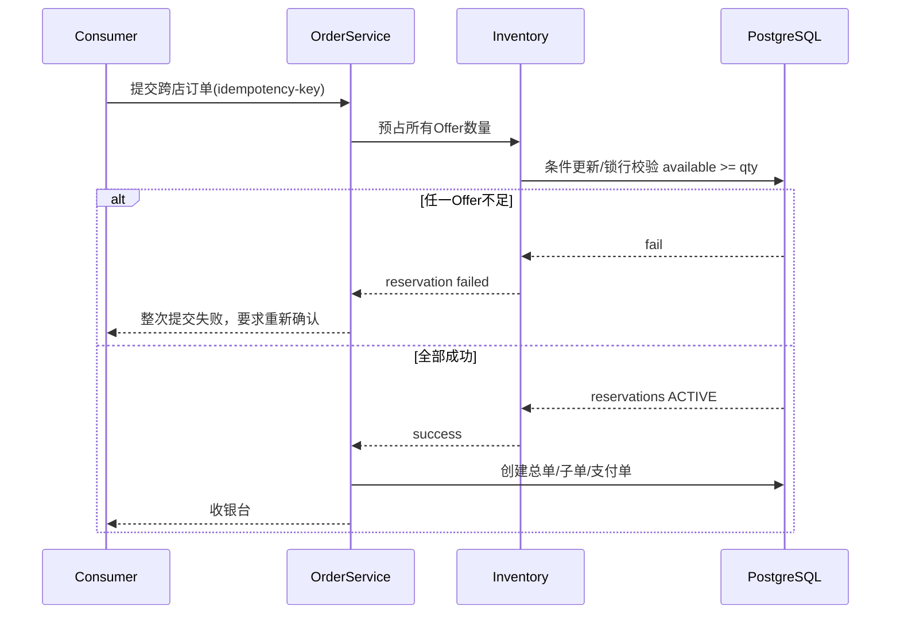
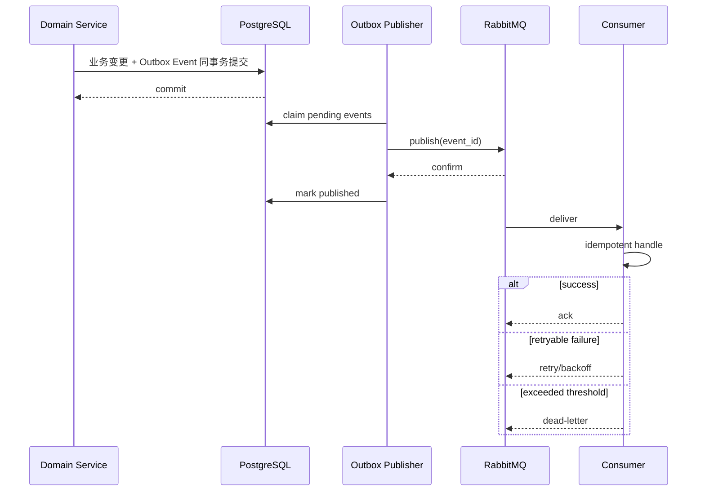

# Pawday V1 订单、支付、库存与结算状态机

版本：M1 1.1（整改复验版） · 2026-10-03  
基准：`01-实施计划.md`、`02-三端页面与跳转信息架构.md`、`03-需求覆盖与验收清单.md`、`04-领域模型与数据库设计.md`，以及 M1 Grill 已确认决策。

> 本文定义 Pawday V1 交易核心对象的状态、迁移、触发者、事务边界、幂等、超时、重试与补偿规则。它是后续 OpenAPI、数据库约束、后台任务和验收测试的执行基准，不代表代码已实现。

---

## 1. 设计目标与不可破坏原则

Pawday 是多商户统一结账平台。交易状态机必须优先保证：**不超卖、不重复扣款、不重复退款、不静默改账、不因异步失败丢失财务事实、不因客户端返回码误判支付成功**。

核心原则：

1. **履约真实状态在商家子订单**；父订单状态由子订单聚合计算，不允许后台人员直接修改父状态。
2. **库存先预占，再支付确认后正式扣减**；未支付超时自动释放。
3. **同一次跨店提交要么全部创建成功，要么整体失败**；任何 Offer 库存预占失败都不得静默换商家。
4. **支付成功以后端验签回调/主动查询为准**；客户端“成功页”不是账务依据。
5. **退款、支付、积分、结算采用独立单据或账本**，不通过修改历史记录隐藏变化。
6. **关键写操作必须幂等**：下单、支付确认、退款、确认收货、积分奖励、会员权益发放、优惠券核销等必须有幂等键或业务唯一键。
7. **优惠在下单时固化分摊快照**；退款按原实付分摊处理，不在售后阶段重新发明订单价格。
8. **正式账本 append-only**；纠错使用调整项，不静默 UPDATE 历史金额。
9. **异步事件使用 Outbox + RabbitMQ**；非核心通知失败不得回滚已成立的支付/财务事实。
10. **所有状态迁移必须明确 actor、前置条件、事务和审计事件**。

---

## 2. 核心交易对象与职责

| 对象 | 作用 | 权威状态来源 |
|---|---|---|
| `Order` | 一次跨店统一结账的父订单 | 由 Suborder/Payment 聚合 |
| `Suborder` | 单商家履约单 | 自身履约状态 |
| `OrderItem` | SKU/Offer 购买快照 | 不随当前商品变化 |
| `InventoryReservation` | 支付前库存预占 | DB 事务 |
| `InventoryBalance` | Offer 库存事实 | DB 最终事实源 |
| `Payment` | 一次订单应付的支付单；成功Attempt确定最终渠道 | 服务端支付确认 |
| `PaymentAttempt` | 微信/支付宝某次发起尝试 | 渠道请求/回调 |
| `Shipment` | 商家发货包裹 | 商家发货动作 |
| `ShipmentItem` | 包裹内订单项/数量 | 发货数量事实 |
| `AfterSale` | 一次售后申请 | 售后状态机 |
| `Refund` | 一次资金退款单 | 支付渠道退款结果 |
| `MerchantLedgerEntry` | 商家资金账本 | append-only |
| `Settlement` | 商家结算批次 | 结算状态机 |

---

## 3. 父订单聚合状态

父订单不承担细粒度履约事实。建议对外展示状态使用派生逻辑，数据库可缓存 `display_status`，但必须可从子订单和支付事实重建。

### 3.1 建议展示状态

- `PENDING_PAYMENT` 待付款
- `PAYMENT_PROCESSING` 支付处理中
- `FULFILLING` 履约中
- `PARTIALLY_SHIPPED` 部分发货
- `AWAITING_RECEIPT` 待收货
- `PARTIALLY_COMPLETED` 部分完成
- `COMPLETED` 已完成
- `CANCELLED` 已取消
- `CLOSED` 已关闭
- `AFTERSALE_ACTIVE` 售后处理中（可作为附加旗标，不建议替代主履约状态）

### 3.2 聚合示例

| 子订单/支付组合 | 父订单展示 |
|---|---|
| 支付单待支付，所有子单待付款 | 待付款 |
| 支付处理中 | 支付处理中 |
| 已支付，至少一个子单待发货/已发货 | 履约中 |
| 至少一个子单已发货，另一个仍待发货 | 部分发货 |
| 所有未取消子单均已发货且未完成 | 待收货 |
| 部分子单完成、部分仍履约 | 部分完成 |
| 所有有效子单完成 | 已完成 |
| 所有子单取消且无成功支付 | 已取消/关闭 |

后台禁止提供“手工把总单改成已完成”的普通功能。

---

## 4. 商家子订单状态机

### 4.1 状态

- `PENDING_PAYMENT` 待付款
- `PAID_WAITING_FULFILLMENT` 已付款待履约
- `PARTIALLY_SHIPPED` 部分发货
- `SHIPPED_WAITING_RECEIPT` 已发货待收货
- `PARTIALLY_COMPLETED` 部分完成（存在部分收货/部分取消等聚合场景）
- `COMPLETED` 已完成
- `CANCELLED` 已取消

售后进度不建议覆盖主履约状态；另使用售后对象和 `has_active_aftersale` 等派生字段。

### 4.2 核心迁移

| 当前状态 | 事件 | 条件 | 新状态 | 触发者 |
|---|---|---|---|---|
| PENDING_PAYMENT | payment_confirmed | 父支付成功 | PAID_WAITING_FULFILLMENT | 系统 |
| PENDING_PAYMENT | order_expired | 支付窗口超时且未成功 | CANCELLED | 定时任务 |
| PAID_WAITING_FULFILLMENT | ship_partial | 发货数量 < 可履约数量 | PARTIALLY_SHIPPED | 商家 |
| PAID_WAITING_FULFILLMENT | ship_all | 全部有效数量已发货 | SHIPPED_WAITING_RECEIPT | 商家 |
| PAID_WAITING_FULFILLMENT | cancel_unfulfilled | 符合取消规则 | CANCELLED 或保持部分有效 | 用户/商家/平台 |
| PARTIALLY_SHIPPED | ship_more | 尚有未发货数量 | PARTIALLY_SHIPPED / SHIPPED_WAITING_RECEIPT | 商家 |
| SHIPPED_WAITING_RECEIPT | confirm_receipt | 用户明确确认该子单/包裹收货 | COMPLETED 或 PARTIALLY_COMPLETED | 用户 |
| 任意履约态 | aftersale_created | 对可售后数量发起售后 | 主状态不直接覆盖 | 用户 |

### 4.3 不可逆边界

V1 规则：

- **尚未实际发货的数量可以按规则取消**；
- **已经发货的数量进入售后流程**；
- “商家接单”“打印单据”等内部动作本身不自动构成不可逆边界；
- 具体不可取消原因必须由服务端返回，客户端不能自行判断。

---

## 5. Shipment 部分发货状态机

一个子订单可拆多个包裹；同一 SKU 数量也允许拆包。

### 5.1 Shipment 状态

- `DRAFT`
- `SHIPPED`
- `IN_TRANSIT`
- `DELIVERED`
- `EXCEPTION`
- `CANCELLED`

### 5.2 关键约束

1. `SUM(shipment_item.quantity)` 不得超过订单项的有效可发货数量。
2. 已取消/已退款的未发货数量不得继续加入新 Shipment。
3. 商家更正运单号必须留审计记录；原值不可无痕覆盖。
4. Shipment 已发货后不通过“取消订单”回滚，需进入物流/售后处理。
5. 子订单状态由所有有效 Shipment 与未发货数量共同聚合。

---

## 6. 库存状态机

库存以 `Offer` 为销售维度。

### 6.1 库存字段建议

- `on_hand_qty` 实物/可管理库存
- `reserved_qty` 已预占未支付
- `sold_qty` 已成交扣减（可通过流水重建）
- `available_qty = on_hand_qty - reserved_qty`

数据库实现可使用单行余额 + append-only 流水；具体字段命名以 04 文档为准。

### 6.2 Reservation 状态

- `ACTIVE`
- `CONSUMED`
- `RELEASED`
- `EXPIRED`

### 6.3 预占流程

### 6.4 锁定期限

- 后台可配置；
- V1 默认 **15 分钟**；
- 配置值必须版本化，订单创建时保存本次过期时间 `reservation_expires_at`；
- 修改全局配置不得改变已经创建订单的过期时间。

### 6.5 支付成功

支付确认事务/可靠流程中：

1. 锁定相关 reservation；
2. 若仍 `ACTIVE`，转为 `CONSUMED`；
3. 正式扣减对应可售库存；
4. 保证重复支付回调不会重复扣库存；
5. 发布 `OrderPaid` Outbox 事件。

### 6.6 超时释放

- 定时任务扫描过期 `ACTIVE` reservation；
- 条件更新为 `EXPIRED/RELEASED`；
- 恢复 `reserved_qty`；
- 关闭仍未成功支付的订单/支付单；
- 操作必须幂等。

---

## 7. 下单原子边界

跨店一次提交必须具备全有或全无语义。

### 7.1 必须在同一核心事务内完成

- 校验当前 Offer 仍可售；
- 校验价格/会员价/运费/优惠仍有效；
- 校验地址配送条件；
- 预占所有 Offer 库存；
- 固化优惠分摊；
- 创建父订单；
- 创建各商家子订单；
- 创建订单项快照；
- 创建支付单；
- 创建必要 Outbox 事件。

### 7.2 任何一项失败

整个提交失败，不生成半套可见订单，不静默替换 Offer，不自动删除缺货商品后继续收费。

---

## 8. 价格与优惠分摊（正式版本 PRICING_V1_1）

### 8.1 金额、规则与快照

金额使用整数分，计算使用整数乘除/任意精度中间值。`pricing_rule_versions` 持久化不可变参数JSON、版本号、hash、发布时间、创建人。V1初始版本 `PRICING_V1_1`，尾差版本 `LARGEST_REMAINDER_V1`；Quote、订单和分摊记录均引用相同版本。规则发布不改旧Quote依据；下单发现资格/事实变动必须重新报价确认。

### 8.2 叠加和执行顺序

本次正式选择“先商家，再平台，运费单独优惠”：

1. 基础单价：会员有资格且请求使用会员价时选择有效会员价，否则普通价；会员价不作为再减一次的券。
2. 商家商品活动：每行最多一种有效商品价活动；排他组只选一个，按版本配置priority决定，等优先级按活动ID排序。禁止出现无法确定的活动组合。
3. 商家券：**每商家最多1张**，基于该商家活动后符合券范围的商品剩余金额验证门槛和分摊。
4. 平台商品活动：每行最多一种，按版本priority/排他组；只作用于商家优惠后的商品余额。
5. 平台券：**整次结账最多1张**；新人券属于平台商品券槽位，不能与另一平台券同时使用。门槛与分摊基数为此时符合范围的商品剩余金额，不含运费。
6. 商家运费：按地址、重量、配送范围和模板计算；包邮门槛正式使用步骤2结束后的本商家商品金额（扣商品活动、未扣券），含哪些商品由模板版本明确。
7. 运费优惠：先平台运费补贴，再运费券；**整次结账最多1张运费券**，按各符合范围商家剩余运费比例分摊，不抵扣商品。
8. 校验总额和最低实付，冻结每个阶段的金额和来源。无资格、超槽位或不允许叠加直接422 `COUPON_STACKING_CONFLICT` / `COUPON_NOT_ELIGIBLE`；不自动替换用户选择的券。

“同类型最多1张”按上述商家/整单槽位解释：两商家可各有一张商家券；同商家不可两张。品牌/品类/会员券类型只预留，V1未发布不进入试算。预算和个人资格在下单事务再次锁定验证。

### 8.3 最低实付与截断

商品行实付最低0分，运费最低0分，任何折扣不得超过当前符合范围余额。正式商品总订单最低应付**1分**；V1不支持0元商品订单。每阶段先截断为 `min(请求折扣,符合范围余额)`；完整运费和优惠计算后执行下述逆序撤回，使实际总应付至少1分，不得在最后伪造额外费用。

实现步骤：先执行1–5计算商品折扣，再执行6确定原运费，再执行7；若最终应付为0，按优惠应用顺序的逆序，撤回最近有效优惠1分并重放分摊（锁定其他阶段优惠总额与资格，不重新触发活动），以保留1分。若原价本身为0且无可撤回优惠，返回422 `ZERO_PAYABLE_ORDER_NOT_SUPPORTED`。下单Quote中明确显示实际使用/截断优惠；禁止暗中返还差额或改变券面值。会员订单同样禁止零额支付，免费会员权益通过权益发放而不是伪造支付单。

### 8.4 正式尾差算法 LARGEST_REMAINDER_V1

每阶段对符合条件行/运费组的非负余额b_i、总基数B和截断后优惠D，要求0<=D<=B：

1. B=0时D必须0，所有分摊0；禁止除零。
2. q_i = floor(D*b_i/B)，r_i = (D*b_i) mod B，使用整数算法。
3. R = D - sum(q_i)。按r_i降序、稳定allocation_key升序，前R个对象各加1分。
4. 校验每行discount<=b_i、总分摊=D、所有余额>=0。后续阶段使用上阶段剩余金额，不再用原价。

商品allocation_key由Quote创建时稳定分配并复制到订单；运费键为merchant_id规范字符串。不得使用随机的新order_item_id造成Quote和Order重放尾差不同。案例：b=[1,1,1], D=2，结果[1,1,0]；b=[6000,4000],D=2000→[1200,800]。

### 8.5 退款分摊与返券

冻结后部分退款不重算满减、不追缴券优惠。订单项数量q，实付P，拆为每个逻辑单位的固定退款额度：floor(P/q)，前P mod q个单位按单位序号各加1分。取消/售后事务分配未被占用的单位序号；仅退款成功计入已退，处理中的占用防重复。这些单位额度持久化于04的order_item_refund_units与claims，只用于按数量分配冻结商品实付，不改变SKU单价事实。

例如数量3、商品实付100分，单位额度[34,33,33]；分三次退款总额恰好100分。运费使用单独快照，未发货整子单取消退实际支付运费；发货后依据责任和平台政策。整优惠范围全部取消可按下单快照返券；部分退款不返券。

### 8.6 Quote状态

ACTIVE → CONSUMED（下单事务成功）、EXPIRED（未消费超时）、INVALIDATED（确认依据失效）。消费一次，失败事务不变CONSUMED；同幂等键先重放既有订单。具体持久化字段和约束见04第9.2节。

---

## 9. 优惠券状态机

持券实例正式状态（定义的发布状态另列于04）：

- `AVAILABLE`
- `RESERVED`
- `USED`
- `RETURNED`
- `EXPIRED`
- `VOID`

### 9.1 下单

- Quote不锁券；创建订单同事务 AVAILABLE/RETURNED → RESERVED，绑定唯一order_id与过期时间。
- 单次Attempt失败但Payment仍可重试时保持RESERVED；订单取消/超时且未成功支付后，仍有效转回AVAILABLE，原为RETURNED的保留该来源；已过期转EXPIRED。
- Payment正常成功同事务 RESERVED → USED，并插入唯一核销事件。
- 全优惠范围取消且原退款完成、政策允许、未过期、未VOID时 USED → RETURNED；同一返券事件只处理一次。
- 有效期到达时 AVAILABLE/RETURNED → EXPIRED；RESERVED在订单终结释放时检查到期，不能只靠券到期任务解锁正在支付的订单。
- 风险作废转VOID并留事件；已USED的财务记录不删除，返还到VOID不允许。USED作废是停止未来返还，不冲销既有订单。

### 9.2 退款返券

已确定规则：

- 整单或对应优惠范围全部取消，且券仍满足返还政策时，可返还；
- 部分退款通常不返券；
- 是否返还、返还后有效期等必须来自券规则快照；
- 售后人员不得临时决定。

---

## 10. 支付状态机

### 10.1 Payment 状态

- `PENDING`
- `PROCESSING`
- `SUCCEEDED`
- `FAILED`
- `CLOSED`

退款不直接把 Payment 改成“退款完成”；退款金额通过 Refund 聚合。可维护：

- `refunded_amount_fen`
- `refundable_amount_fen`

Payment.successful_attempt_id在确认真实成功时受控设置一次；final_channel只读派生，金额、币种和主体必须匹配。若第二个Attempt实际收款，保存异常款项并绑定该Attempt原路退款，不覆盖Payment已有成功关系。

### 10.2 PaymentAttempt 状态

- `CREATED`
- `CHANNEL_REQUESTED`
- `CHANNEL_PENDING`
- `CHANNEL_SUCCEEDED`
- `CHANNEL_FAILED`
- `CANCELLED`

同一个 Payment 可以发生多个 attempt（例如微信失败后切支付宝），但必须保证：

- 不能同时让两个渠道都处于可成功扣款的无约束状态；
- 一旦 Payment 已 `SUCCEEDED`，后续成功尝试必须进入异常补偿而不是再次记账。

### 10.3 支付确认来源

支付成功只接受：

1. 服务端验签成功的渠道回调；或
2. 服务端主动查询渠道确认成功。

客户端返回码只能用于交互提示，不能驱动订单入账。

### 10.4 幂等

`payment_confirmed(channel_transaction_id)` 必须具备唯一约束或等价幂等机制。

重复回调只返回已处理结果，不得：

- 再扣库存；
- 再记商家账；
- 再发会员权益；
- 再发积分。

---

## 11. 支付超时与晚到成功补偿

这是 V1 必须有明确策略的异常路径。

### 11.1 正常超时

当支付窗口到期且渠道未确认成功：

1. `Payment -> CLOSED`；
2. 未支付订单关闭；
3. 库存 reservation 释放；
4. 券按规则释放；
5. 写入关闭事件。

### 11.2 晚到成功

若订单/Payment 已关闭后，渠道又确认真实收款成功：

1. 不忽略回调；
2. 校验渠道交易唯一性与真实到账；
3. 创建 `LatePaymentCase` 或等价异常记录；
4. 默认策略：**优先自动原路退款**；
5. 只有满足明确、可审计的恢复履约条件时才允许恢复订单；
6. 不得在库存已经卖给其他人后强行恢复履约；
7. 事件必须进入运营/财务可追踪队列。

### 11.3 恢复履约条件（V1建议收紧）

V1 默认不自动恢复。若未来开放，应至少同时满足：

- 原全部 Offer 库存仍可重新锁定；
- 原价格和商户履约仍有效；
- 用户明确同意继续履约；
- 财务/支付状态可一致恢复；
- 全过程留审计。

---

## 12. 取消状态机

### 12.1 未付款取消

用户取消或超时：

- 关闭订单与支付；
- 释放库存；
- 释放符合规则的券；
- 不产生退款单。V1未付款仅允许整个父订单全部取消；部分子单/数量取消返回422 `UNPAID_PARTIAL_CANCELLATION_NOT_ALLOWED`，重新Quote建单，不能保留旧Payment金额。

### 12.2 已付款未发货取消

对于尚未发货的有效数量：

1. 创建04第10.3.1正式取消单与明细；持order_item行锁校验未发货及未占售后数量。
2. 接受取消即冻结取消数量、停止发货、写append-only事件并更新cancelled_qty可重建缓存。
3. 按冻结单位额度计算退款；整未发货子单取消退实付运费。
4. 同事务创建绑定successful_attempt的Refund意图和库存恢复唯一事件；取消→REFUND_PENDING。
5. 退款成功只更新资金结果、账本和取消→COMPLETED；不得再次增加cancelled_qty/恢复库存。
6. 退款失败保持取消已成立，重试原退款号，不恢复履约。库存恢复不能重放两次。

### 12.3 已发货

不再使用普通“取消订单”，进入售后。

---

## 13. 商家缺货补偿

已付款后若商家发现某订单项无法履约：

- 不取消整个父订单；
- 只取消受影响的子订单/订单项数量；
- 其他商家继续履约；
- 受影响部分原路退款；
- 记录商家履约异常；
- 风控/商家绩效可消费该事件。

平台不得未经用户同意自动换另一商家。

---

## 14. 售后状态机

### 14.1 AfterSale 状态

- `PENDING_MERCHANT`
- `WAITING_RETURN`
- `RETURN_IN_TRANSIT`
- `WAITING_INSPECTION`
- `REFUND_PENDING`
- `PLATFORM_ESCALATED`
- `COMPLETED`
- `REJECTED`
- `CANCELLED`

具体类型：

- 仅退款
- 退货退款
- 其他平台允许的售后类型

### 14.2 数量约束

每个 `OrderItem`：

`累计成功售后数量 + 处理中锁定售后数量 <= 可售后数量`

并发申请必须由数据库条件更新/约束阻止超量申请。

### 14.3 商家处理

用户申请 -> `PENDING_MERCHANT`。

商家在 SLA 内：

- 同意仅退款 -> `REFUND_PENDING`
- 同意退货 -> `WAITING_RETURN`
- 拒绝 -> `REJECTED`，用户可按规则平台介入

超时可根据平台政策自动进入异常/平台介入，规则后台配置。

### 14.4 平台介入

`PLATFORM_ESCALATED` 保存：

- 用户证据；
- 商家回应；
- 平台最低售后规则；
- 裁决人；
- 裁决原因；
- 金额/数量决定；
- 审计信息。

平台裁决“退款成立”只代表可以发起退款，不代表渠道退款已经到账。

---

## 15. Refund 状态机

### 15.1 状态

- `CREATED`
- `PROCESSING`
- `SUCCEEDED`
- `FAILED_RETRYABLE`
- `FAILED_FINAL`
- `CANCELLED`

### 15.2 退款金额来源

退款上限来自订单项/运费/优惠的原始实付快照：

`累计成功退款金额 + 当前处理中金额 <= 当前最大可退金额`

禁止直接按商品当前售价退款。

### 15.3 退款渠道

V1 原路退回原支付渠道，不建设 Pawday 钱包。

### 15.4 失败与重试

- 网络错误、渠道临时错误 -> `FAILED_RETRYABLE`；
- 后台任务以相同业务退款号幂等重试；
- 有限次数指数退避；
- 超过阈值进入异常队列；
- 需要人工处理时不得新建不同退款号绕过幂等。

售后页面必须区分：

- 售后已同意；
- 退款处理中；
- 退款成功；
- 退款异常。

---

## 16. 运费退款规则

V1 基线：

1. **未发货整子单取消**：退该子单实际支付运费。
2. **发货后部分售后**：按责任方和平台政策计算。
3. 商家责任（如发错、质量问题）可承担退回运费/原运费，具体策略后台版本化。
4. 用户原因售后按平台售后规则处理。
5. 所有结果保存 `shipping_refund_allocation` 或等价快照，禁止仅凭客服备注。

---

## 17. 商家账本状态与记账时点

### 17.1 append-only

`merchant_ledger_entries` 不允许普通业务更新历史金额。

正式类型（与04账本一致）：

- `SALE_CREDIT`
- `COMMISSION_DEBIT`
- `SHIPPING_ADJUSTMENT`
- `REFUND_DEBIT`
- `COMMISSION_REVERSAL`
- `SETTLEMENT_DEBIT`
- `SETTLEMENT_ADJUSTMENT`
- `MANUAL_ADJUSTMENT`

### 17.2 支付成功

生成对应商家待结算经济事实，但未满足结算条件前不得显示为“已到账/可提现”。

### 17.3 退款

创建负向或冲销账本项，不修改原销售账本。

### 17.4 人工调整

必须包含：

- 原关联记录；
- 调整原因；
- 操作者；
- 审批/权限信息；
- 调整金额；
- 审计事件。

---

## 18. 佣金状态与退款回算

订单支付成功时固化：

- 佣金策略版本；
- 适用优先级；
- 各订单项佣金计算基数；
- 佣金金额。

部分退款时按退款对应实付金额比例/已固化分配计算佣金冲销。

不得使用当前最新佣金率回算历史订单。

---

## 19. 结算状态机

### 19.1 状态

- `WAITING_RECEIPT`
- `BUFFERING`
- `FROZEN`
- `ELIGIBLE`
- `PROCESSING`
- `SETTLED`
- `FAILED_RETRYABLE`
- `ADJUSTED`

### 19.2 默认售后缓冲

- 后台可配置；
- V1 默认 **7 天**；
- 可按商户/政策覆盖；
- 订单/子订单必须记录本次实际使用的政策版本和 `eligible_at`。

### 19.3 确认收货后

子订单满足结算计时条件：

`WAITING_RECEIPT -> BUFFERING`

到期且无阻断售后/风控：

`BUFFERING -> ELIGIBLE`

### 19.4 售后冻结

缓冲期或结算前出现需要影响资金的售后：

`BUFFERING/ELIGIBLE -> FROZEN`

处理完成后重新计算可结算金额，恢复 `ELIGIBLE` 或继续冻结。

### 19.5 已结算后退款

历史 Settlement 不修改。

新建：

- `REFUND_DEBIT`
- `COMMISSION_REVERSAL`
- `SETTLEMENT_ADJUSTMENT`

从商家后续可结算金额抵扣；不足时允许形成平台定义的商家应收余额。

禁止要求运营人员用“线下转账后改数据库”作为正常流程。

---

## 20. 会员订单与有效期状态机

商品订单与会员订单分类型，不混用履约状态。

### 20.1 MembershipOrder 状态

- `PENDING_PAYMENT`
- `PAID`
- `REFUND_PENDING`
- `REFUNDED`
- `CLOSED`

### 20.2 有效期

用户已有有效会员时再次购买：

`new_end_at = current_end_at + purchased_duration`

而不是从购买日重置。

### 20.3 V1 不做自动续费

仅手动购买月卡/年卡。未来若增加自动续费必须新增授权协议、扣款计划、解约和失败重试状态，不复用 V1 手动购买逻辑冒充自动续费。

### 20.4 会员退款

退款根据：

- 剩余有效期；
- 已消耗会员权益；
- 已使用会员券/运费券；
- AI 会员额度等政策；

按已发布规则计算。

历史商品会员价订单不追溯重定价。

---

## 21. 积分账本状态机

积分使用 append-only ledger。

建议事件：

- `PURCHASE_EARN`
- `REVIEW_EARN`
- `MEDIA_REVIEW_BONUS`
- `CHECKIN_EARN`
- `REDEMPTION_SPEND`
- `REFUND_CLAWBACK`
- `MANUAL_ADJUSTMENT`

### 21.1 幂等

积分奖励必须绑定唯一业务事件，例如：

`purchase_reward:{order_item_id}`

`review_reward:{review_id}`

重复消费同一事件返回已处理结果。

### 21.2 退款追回

退款按对应比例生成 `REFUND_CLAWBACK`。

若用户已花掉积分，余额允许为负；后续获得积分先抵扣负余额。余额<0禁止任何新兑换，非负余额也必须足够支付兑换成本；校验与扣减在同事务、同账户锁下执行。

---

## 22. AI 额度账本（与交易幂等一致）

虽然不属于资金支付，但使用相同的可追溯原则。

额度只在满足定义的成功完成条件后扣减；网络失败、系统错误不扣或自动回退。

正式状态：

- `RESERVED`：每请求必须先原子预占，防止并发绕过上限。
- `CONSUMED`：业务校验通过且有效Assistant Message成功持久化，在同事务确认消费。
- `RELEASED`：模型/系统/业务失败或lease超时，释放预占；终态不再接受晚完成。

仅 RESERVED → CONSUMED 或 RESERVED → RELEASED；重复终态事件无副作用。模型已返回但落库失败必须释放，不能永久扣额度。请求重试使用同ai_request_id恢复原结果；释放后重新请求创建新的业务ID。

每次 AI 请求使用 `ai_request_id` 唯一键，防止客户端重试重复扣额度。

---

## 23. 幂等键规范

### 23.1 客户端关键写请求

Header 建议：

`Idempotency-Key: <uuid>`

适用：

- 创建订单；
- 提交支付意图；
- 申请售后；
- 确认收货；
- 会员购买；
- 积分兑换。

### 23.2 服务端业务唯一键

- 支付回调：`channel + provider_merchant_ref + channel_transaction_id`
- 退款：`refund_business_no`
- 库存 reservation：`order_id + offer_id`
- 积分奖励：`event_type + business_id`
- 优惠券核销：`coupon_instance_id + order_id`
- 会员权益：`membership_order_id + benefit_type`

### 23.3 幂等响应

同一幂等键、同一请求语义重复提交：返回第一次已成立结果。

同一幂等键但请求体关键字段不同：返回冲突错误，不允许覆盖第一次结果。

---

## 24. Outbox 与 RabbitMQ 事件状态机

### 24.1 核心流程

### 24.2 Outbox 状态

- `PENDING`
- `PUBLISHING`
- `PUBLISHED`
- `FAILED_RETRYABLE`
- `DEAD`

### 24.3 消费失败

- 有限次数指数退避；
- 超限进入 DLQ/异常任务；
- 支持人工重放；
- Consumer 必须以 `event_id` 幂等；
- 通知失败不能让 `Payment SUCCEEDED` 回滚。

---

## 25. 关键领域事件清单

V1 至少定义：

- `OrderCreated`
- `OrderExpired`
- `InventoryReserved`
- `InventoryReleased`
- `PaymentConfirmed`
- `PaymentClosed`
- `LatePaymentDetected`
- `SuborderPaid`
- `ShipmentCreated`
- `SuborderPartiallyShipped`
- `SuborderShipped`
- `SuborderReceived`
- `AfterSaleCreated`
- `AfterSaleEscalated`
- `RefundRequested`
- `RefundSucceeded`
- `RefundFailed`
- `SettlementEligible`
- `SettlementCompleted`
- `SettlementAdjustmentCreated`
- `CouponUsed`
- `CouponReturned`
- `PointsGranted`
- `PointsClawedBack`
- `MembershipActivated`
- `MembershipExtended`
- `MembershipRefunded`
- `OfferChanged`
- `CatalogStandardPublished`

事件 schema 必须版本化，例如 `event_type + event_version`。

---

## 26. 搜索索引同步状态机

商品、SKU、Offer、品牌等变化通过可靠事件增量同步专用搜索服务。

### 26.1 增量

`CatalogStandardPublished / OfferChanged -> SearchIndexJob`

状态：

- `PENDING`
- `PROCESSING`
- `SUCCEEDED`
- `FAILED_RETRYABLE`
- `DEAD`

### 26.2 全量能力

必须支持：

- 全量重建；
- DB 与索引差异校验；
- 指定 SPU/SKU/Offer 重建；
- 重建期间别名/版本切换，避免半索引状态直接暴露。

搜索索引不是商品事实源；结账必须回数据库重校验。

---

## 27. 商品标准版本与适配结果

商品标准资料发布后生成不可变版本引用。

规则：

- 新的搜索/适配/AI 请求使用最新已发布版本；
- 历史订单保存购买时商品快照/版本；
- 历史 AI 消息保存当时引用的 SKU/标准版本或证据引用；
- 新版本不得回写过去订单或篡改过去 AI 输出记录；
- 适配缓存如果存在，版本变更后必须失效或以版本 key 区分。

---

## 28. AI Prompt / 规则版本发布状态机

状态建议：

- `DRAFT`
- `VALIDATED`
- `STAGED`
- `ACTIVE`
- `ROLLED_BACK`
- `ARCHIVED`

发布规则：

1. 版本不可覆盖；
2. 发布前可运行评测集；
3. 支持灰度；
4. 发生问题快速切回上一已验证版本；
5. 所有发布/回滚写审计；
6. 过敏等硬安全规则不由 Prompt 文案代替。

---

## 29. 审计事件要求

以下状态迁移必须至少记录：

- actor id / actor type / role；
- 时间；
- 请求来源、设备/IP 的安全摘要（按隐私策略）；
- 对象类型与 id；
- action；
- before/after diff 或状态迁移；
- 业务关联 ID；
- reason/code；
- correlation_id / request_id；
- 敏感字段脱敏。

重点覆盖：

- 商家发货/改运单；
- 售后同意/拒绝；
- 平台裁决；
- 退款异常人工处理；
- 佣金/结算策略修改；
- 账本调整；
- Offer 冻结/解冻；
- AI Prompt/规则发布回滚；
- 权限变更；
- 高风险账号操作。

---

## 30. 定时任务

V1 至少需要：

1. 订单/库存预占超时关闭与释放；
2. 支付状态主动补查；
3. 退款失败重试；
4. 售后 SLA 扫描；
5. 结算缓冲期到期计算；
6. 结算失败重试；
7. Outbox 发布；
8. DLQ/失败任务告警；
9. 搜索同步重试；
10. 当前粮余量提醒；
11. 消息/Push 异步发送；
12. 风控周期任务。

所有任务必须支持：

- 多实例安全；
- 重复执行幂等；
- 任务锁/claim；
- 指标与告警；
- 人工重放/补偿入口。

---

## 31. 错误与补偿矩阵

| 场景 | 核心事实 | 补偿 |
|---|---|---|
| 下单中某 Offer 库存失败 | 订单未成立 | 整体回滚，提示重新确认 |
| 创建订单后客户端断网 | 服务端订单可能已成立 | 用幂等键查询首次结果 |
| 支付客户端显示失败但渠道成功 | 渠道真实成功 | 后端回调/查询确认，订单转成功 |
| 支付重复回调 | 首次已记账 | 幂等返回，不重复扣库存 |
| 支付超时正常无款 | 订单关闭 | 释放库存/券 |
| 支付关闭后晚到成功 | 已真实收款但订单关闭 | 异常 case，默认原路退款 |
| 商家已付款后缺货 | 其他子单仍有效 | 仅受影响项退款，记录商家异常 |
| 通知失败 | 支付/订单事实已成立 | 重试通知，不回滚支付 |
| 搜索同步失败 | DB 商品事实有效 | 重试索引，不影响数据库事实 |
| 退款渠道临时失败 | 售后决定仍成立 | 自动幂等重试，超限人工 |
| 已结算后退款 | 历史结算已成立 | 新建负向调整，后续抵扣 |
| 积分已花后退款 | 退款事实优先 | 积分账本允许负余额 |

---

## 32. 服务端状态迁移权限

| 动作 | 消费者 | 商家员工 | 平台 | 系统 |
|---|---:|---:|---:|---:|
| 提交订单 | ✓ |  |  |  |
| 取消未发货数量 | ✓按规则 | ✓按规则 | ✓按权限 |  |
| 确认支付成功 |  |  |  | ✓仅服务端渠道确认 |
| 发货 |  | ✓仓库权限 | ✓特殊纠错权限 |  |
| 确认收货 | ✓ |  | ✓异常处理 | 可有未来自动规则但V1需谨慎 |
| 发起售后 | ✓ |  | ✓代客仅受控 |  |
| 售后商家决定 |  | ✓售后权限 |  |  |
| 平台裁决 |  |  | ✓ |  |
| 发起渠道退款 |  |  | ✓/系统 | ✓ |
| 修改账本历史 |  |  |  | 永不允许静默修改 |
| 新建账本调整 |  |  | ✓财务高权限 | ✓规则事件 |
| 结算执行 |  |  | ✓/系统 | ✓ |

服务端权限是最终边界；前端隐藏按钮不构成安全控制。

---

## 33. API 前置契约要求

06 文档必须把本文状态约束落实到 API：

- 所有关键写接口接受 `Idempotency-Key`；
- 返回实体当前 `version`/状态；
- 状态不允许迁移时返回稳定业务错误码；
- 金额统一整数分；
- 时间统一 RFC3339/ISO-8601 带时区；
- 订单/支付/退款查询可恢复异步处理中状态；
- 关键接口提供 `correlation_id` 供审计与排查；
- 不提供普通“直接设置状态”的 CRUD API；
- 状态变化使用命令式动作接口，如 `/ship`、`/cancel`、`/confirm-receipt`、`/escalate`，由服务端校验迁移。

---

## 34. 数据库约束建议

至少包含：

1. `payment_attempt(channel, provider_merchant_ref, provider_transaction_id)`唯一；Payment引用successful_attempt，不存创建时channel；
2. `refund(refund_business_no)` 唯一；
3. `inventory_reservation(order_id, offer_id, reservation_generation)` 业务唯一；
4. `points_ledger(event_type, business_id)` 唯一奖励事件；
5. 订单项退款/售后数量通过事务条件校验；
6. 金额字段 `>= 0`，负向账本使用方向字段或明确允许的 signed amount 规范；
7. `refunded_amount <= paid_amount`；
8. `reserved_qty >= 0`、`on_hand_qty >= 0`；
9. 已发布商品/Prompt/规则版本不可直接覆盖；
10. 账本调整必须引用 adjustment reason 和 actor。

具体 DDL 在工程迁移阶段输出。

---

## 35. M1 状态机验收场景

### S01 并发库存
库存 1，两用户同时提交：仅一方成功预占；另一方整单提交失败，不超卖。

### S02 支付重复回调
同一渠道交易回调 3 次：支付只确认一次、库存只扣一次、商家账本只记一次。

### S03 支付超时
15 分钟默认窗口过期：释放库存、关支付；后台修改默认值不影响已创建订单的过期时间。

### S04 晚到支付
订单关闭后渠道确认真实到账：生成异常 case，不丢款，按默认策略发起原路退款。

### S05 跨店部分发货
A 商家发货、B 商家未发：父订单显示部分发货；A/B 的取消、物流、结算互不覆盖。

### S06 数量拆包
同一订单项 3 件分两包发 2+1：累计发货不得超过3，子单状态正确聚合。

### S07 部分退款
原数量3退1：只占用1个售后数量；第二次最多再申请2；累计退款不超对应实付。

### S08 满减部分退款
100元订单满减20，60/40比例分摊为48/32实付；退40商品按32退款，不追回整个20元券。

### S09 已结算后退款
历史 Settlement 保持不变；生成退款冲销与结算调整，后续可结算额减少。

### S10 积分负余额
购买得100分并全部花掉后全额退款：新增 -100 回退记录，余额可为负，后续积分先抵扣。

### S11 异步通知失败
支付成功后消息发送失败：支付保持成功，消息重试后进入 DLQ，不反向取消订单。

### S12 搜索陈旧
Offer 已下架但索引同步延迟：商品页/加车/结账实时校验失败并提示，不允许因为搜索仍可见就成交。

---

## 36. M1 完成门槛（本文部分）

本文完成不等于工程完成。进入 06 API 契约前必须满足：

- 父单/子单/Shipment/售后/退款/结算状态互不混淆；
- 支付与库存的原子/补偿边界明确；
- 超时与晚回调存在确定策略；
- 优惠分摊与部分退款可重放；
- 财务历史不可静默改写；
- 关键动作均可幂等；
- Outbox/重试/DLQ 规则能解释异步失败；
- 所有状态迁移都能映射到 02 页面动作与 03 验收场景。

下一步：`06-API契约与OpenAPI设计.md`，将本文状态机转换成稳定 REST 命令接口、错误码、幂等、分页、鉴权、版本冲突和 OpenAPI 分组规范。
